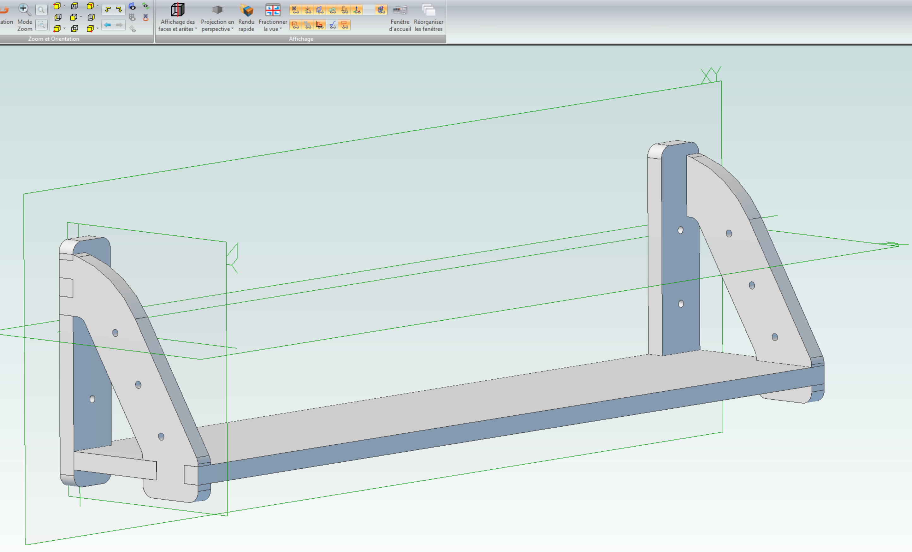
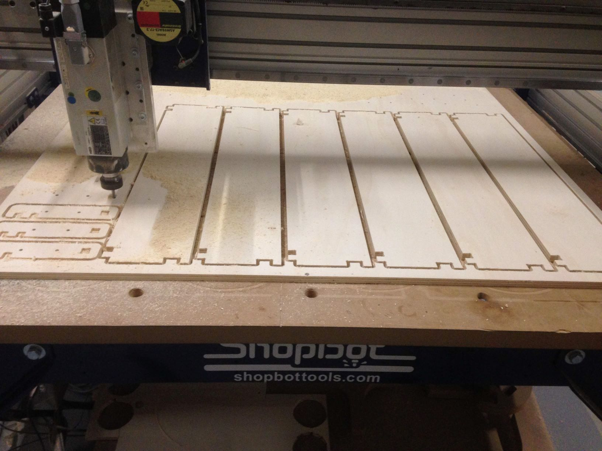
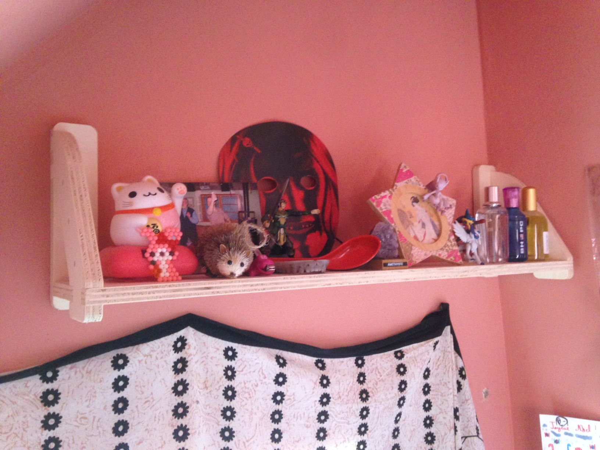

# pocket-books-shelf
A shelf for small books to be made with CNC Machining

- Mill with a 6mm bit
- All parts included in the DXF File
- Material : 15mm Plywood
- Designed with Cubify Design

Think

Make

Share

